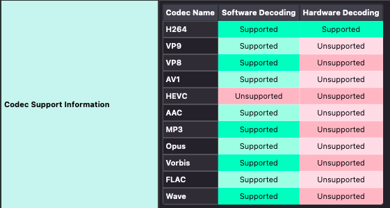

# Configuring Firefox
Prerequisites:\
[Hardware acceleration]()

{: .note }
Fedora KDE uses Wayland by default.

Wayland session

1. Go to `about:support`
1. Ensure that "Window Protocol" is set to "wayland" - if it is not, seek further help on [the PC Help Hub](https://discord.gg/pchh) or elsewhere as it should be.
1. Ensure "Target Frame Rate" is set to your display framerate.
1. Make sure "Hardware compositing" is set to "available"
1. Open `about:config` and set `widget.use-xdg-desktop-portal.file-picker` to 1

X.org session

1. Go to `about:support`
1. Ensure "Target Frame Rate" is set to your display framerate.
1. Make sure "Hardware compositing" is set to "available"

{: .important }
On non Intel GPUs, you may need to set `media.ffmpeg.vaapi.enabled` for hardware decoding.

{: .important}
The VAAPI wrapper from the previous page is required on NVIDIA hardware.

{: .important }
If hardware decoding is disabled with error `FEATURE_HARDWARE_VIDEO_DECODING_DISABLE` or `FEATURE_FAILURE_VIDEO_DECODING_TEST_FAILED`, make sure you've followed [the hardware acceleration setup guide](), and set `media.hardware-video-decoding.force-enabled` to true.

1. Play a video in Firefox.
2. Go to `about:support`
3. Make sure hardware decoding is supported under "Codec Support Information"

{: .important }
As of Firefox 137, Firefox should finally now support HEVC video. However, I haven't had time to test it yet. Unlike the photo above, though, you should now see HEVC: Supported.
