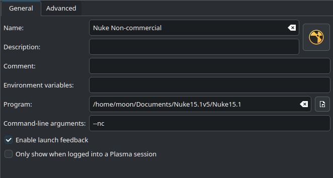

# Installing Foundry's Nuke

This guide was made for Nuke non-commercial, but should work for all versions of Nuke.

1. Once logged in to your Foundry account, download the Linux version of Nuke.
1. Accept the EULA, and download the .tgz file into a folder, i.e. Documents, /opt/, etc.
1. Extract the .tgz file (Right Click > Extract > Extract here and delete archive).
1. Run the .run file extracted (Right click > Open in Konsole).
1. Scroll through the EULA, and then type `y` to approve it.
1. Say `y` to approve the subdirectory.
1. Open Menu Editor
1. Under the Graphics section, make a new menu entry named Nuke.
1. The app icon can be found in NUKE_INSTALL_FOLDER/plugins/icons/NukeApp256.png
1. Add the program executable to the Program section.
1. Fill in any other entries as you see fit.
1. Launch Nuke and set it up normally.

{: .note }
> The Nuke executable always starts as normal Nuke. The following command arguments can be added for other modes:\
> `--nukex`\
> `--studio`\
> `--nukeassist`\
> `--nc (non-commercial)`\
> `--indie`
> 
> Other command arguments can be found [here](https://learn.foundry.com/nuke/content/getting_started/installation/launching_nuke_linux.html).

Here's what my final menu entry looked like for Nuke Non-commercial

